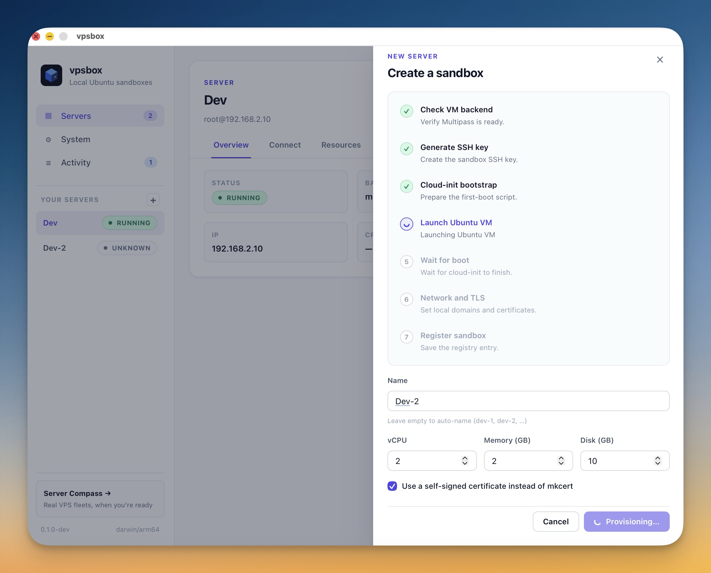
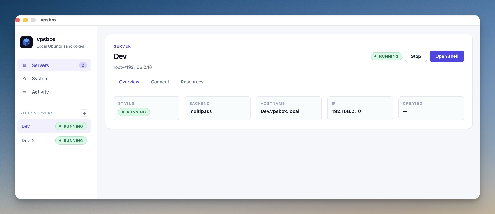
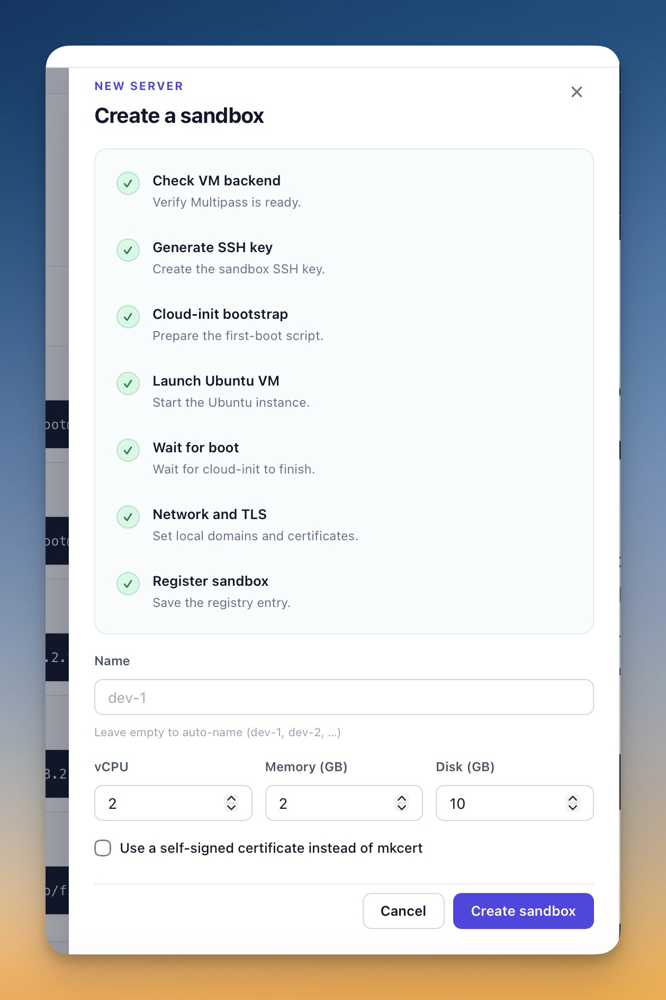
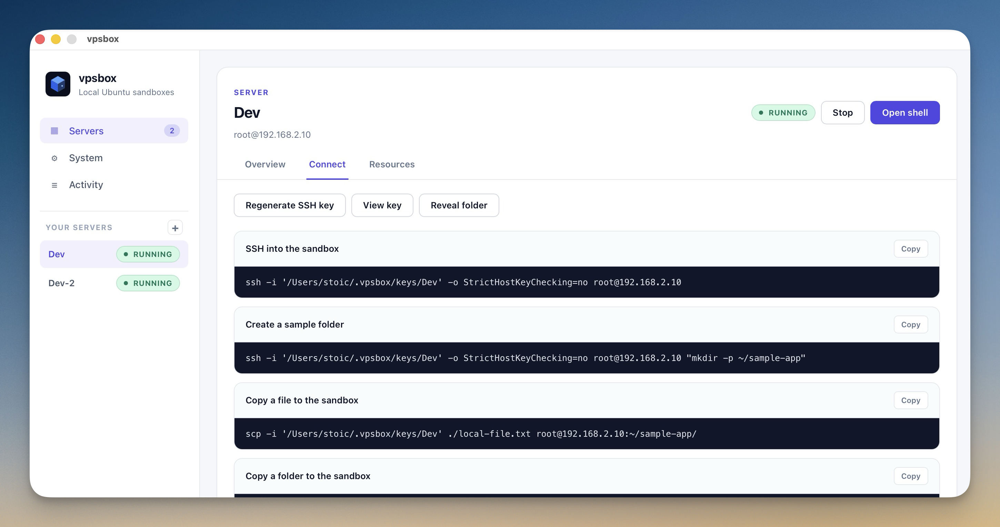

# vpsbox-desktop

`vpsbox-desktop` is the Wails desktop app for VPSBox.

This is a single, self-contained repo that includes both the desktop shell and the VPS engine core:

- native Wails shell
- React frontend
- VPS engine core (`vpsbox-core/`)
- packaging and release automation
- CI builds for macOS, Linux, and Windows

## Demo

[](https://www.youtube.com/watch?v=AHGZ-QoUUWk)

Youtube Demo: [Watch here](https://www.youtube.com/watch?v=AHGZ-QoUUWk)









## End users

End users should download a packaged release and run it.

They do not need the CLI, Go, Node, or any manual setup beyond the standard OS prompts for things like package installation or privileged host changes.

## Local development

### Quick start

From this repo:

```bash
./scripts/dev.sh
```

That script:

1. Runs `go mod tidy`
2. Installs frontend dependencies
3. Starts `wails dev`

### Manual workflow

If you prefer to run the steps yourself:

```bash
go mod tidy
cd frontend && npm install && cd ..
$(go env GOPATH)/bin/wails dev
```

## Production build

```bash
./scripts/build.sh
```

That runs a local production Wails build and outputs artifacts under:

```text
build/bin/
```

## Repo layout

- `app.go`: thin Wails binding layer
- `main.go`: app bootstrap and Wails runtime setup
- `frontend/`: React/Vite UI
- `vpsbox-core/`: VPS engine core (Go package)
- `build/`: Wails platform metadata and packaging assets
- `.github/workflows/build.yml`: CI build matrix

## CI

GitHub Actions builds the app on:

- macOS
- Linux
- Windows

The workflow checks out the core `vpsbox` repo alongside this repo so the local `replace github.com/stoicsoft/vpsbox => ../vpsbox-code` path still works in CI.

## Credits

- [Server Compass](https://servercompass.app/)
- [1DevTool](https://1devtool.com/)
- [StoicSoft](https://stoicsoft.com/)
