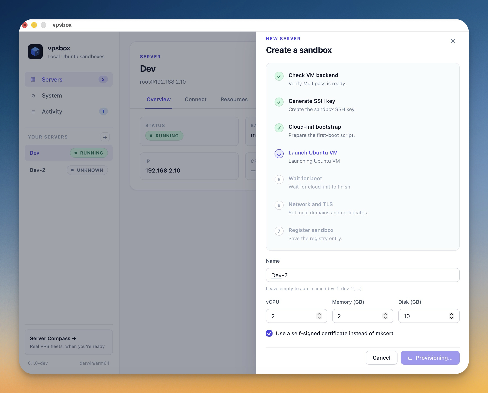
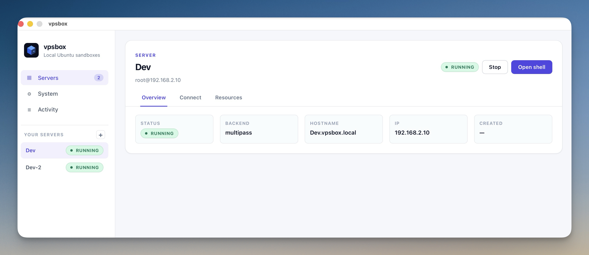
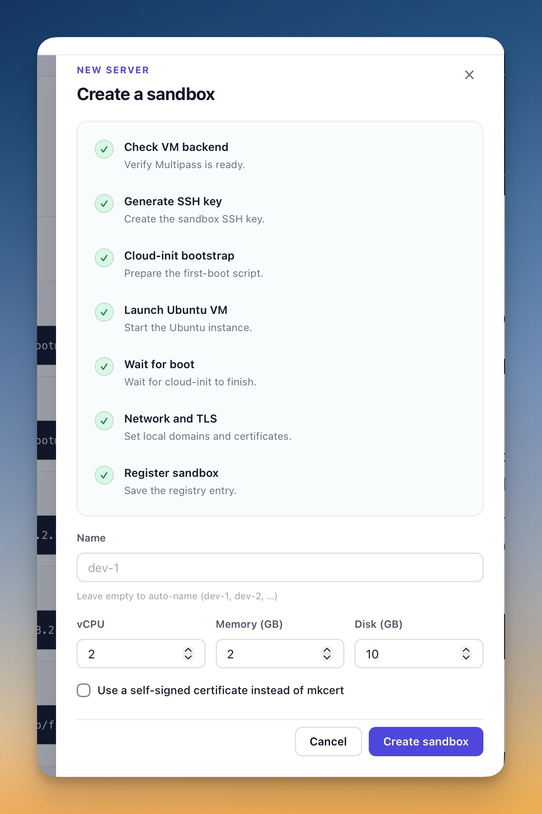
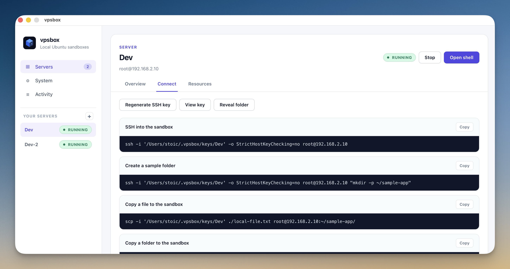

# vpsbox-desktop

`vpsbox-desktop` is the Wails desktop app for VPSBox.

This is a single, self-contained repo that includes both the desktop shell and the VPS engine core:

- native Wails shell
- React frontend
- VPS engine core (`vpsbox-core/`)
- packaging and release automation
- CI builds for macOS, Linux, and Windows

## What is VPSBox?

VPSBox boots a local Ubuntu VM (via Multipass) and presents it as a fresh "VPS" —
real IP, SSH access, root, systemd, an `/etc/hosts` entry, and a TLS cert — so you
can try server deploy tools (Server Compass, Coolify, Dokploy, Dokku, CapRover,
Kamal, etc.) without renting a real cloud server.

### VPSBox vs Docker

They solve overlapping problems at different layers, and are more nested than
competing:

|                | **VPSBox**                                        | **Docker**                             |
| -------------- | ------------------------------------------------- | -------------------------------------- |
| **Unit**       | A full **VM** — a real Ubuntu machine             | A **container** — an isolated process  |
| **Kernel**     | Its own Linux kernel (via Multipass)              | Shares the host kernel                 |
| **You get**    | A fresh VPS with its own IP, SSH, systemd, TLS    | A sandboxed app plus its dependencies  |
| **Mental model** | "Here's a server I rented"                       | "Here's my app packaged up"            |
| **Overhead**   | Heavy (full OS)                                   | Light (just the process)               |

**Docker packages an application** — you build an image and run containers that
share the host's kernel. It's for shipping and running apps reproducibly.

**VPSBox fakes a rented server** — it boots a real Ubuntu VM locally and dresses
it up to behave exactly like a fresh cloud VPS (IP, SSH key, hostname, TLS).

The server deploy tools VPSBox is built to test (Coolify, Dokploy, Kamal, …)
expect a *whole machine*: they SSH in as root, install Docker themselves,
configure systemd, manage the firewall, and provision certs. You can't test that
inside a single container. So the two nest rather than compete:

```text
VPSBox VM (Ubuntu)
  └── the deploy tool you're testing (e.g. Coolify)
        └── Docker containers it spins up for your apps
```

VPSBox gives you the **server**; Docker (running inside that server) gives you the
**app isolation**.

- Want to package and run an app? → Docker
- Want a throwaway server to practice deploying to, that behaves like a real
  cloud VPS? → VPSBox

## Demo

[](https://www.youtube.com/watch?v=AHGZ-QoUUWk)

Youtube Demo: [Watch here](https://www.youtube.com/watch?v=AHGZ-QoUUWk)









## End users

End users should download a packaged release and run it.

They do not need the CLI, Go, Node, or any manual setup beyond the standard OS prompts for things like package installation or privileged host changes.

## Local development

### Quick start

From this repo:

```bash
./scripts/dev.sh
```

That script:

1. Runs `go mod tidy`
2. Installs frontend dependencies
3. Starts `wails dev`

### Manual workflow

If you prefer to run the steps yourself:

```bash
go mod tidy
cd frontend && npm install && cd ..
$(go env GOPATH)/bin/wails dev
```

## Production build

```bash
./scripts/build.sh
```

That runs a local production Wails build and outputs artifacts under:

```text
build/bin/
```

## Repo layout

- `app.go`: thin Wails binding layer
- `main.go`: app bootstrap and Wails runtime setup
- `frontend/`: React/Vite UI
- `vpsbox-core/`: VPS engine core (Go package)
- `build/`: Wails platform metadata and packaging assets
- `.github/workflows/build.yml`: CI build matrix

## CI

GitHub Actions builds the app on:

- macOS
- Linux
- Windows

The workflow checks out the core `vpsbox` repo alongside this repo so the local `replace github.com/stoicsoft/vpsbox => ../vpsbox-code` path still works in CI.

## Credits

- [Server Compass](https://servercompass.app/)
- [1DevTool](https://1devtool.com/)
- [StoicSoft](https://stoicsoft.com/)
